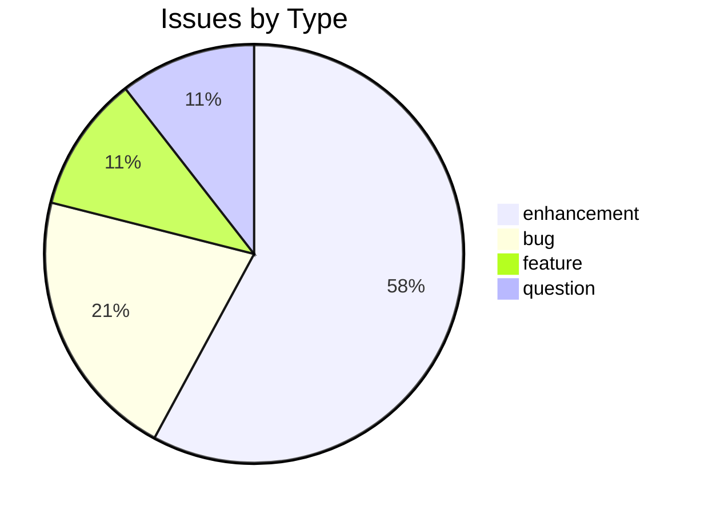
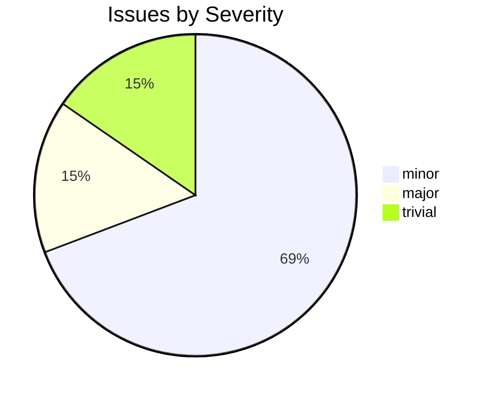

# hwnorm1

CDSL **processing-tool** repository in the Sanskrit Lexicon project.

## Issues Overview

**Total**: 19 | **Open**: 16 | **Closed**: 3

### By Milestone

| Milestone | Open | Closed | Total |
|---|---|---|---|
| Unassigned | 16 | 3 | 19 |

### By Type



### By Severity



## GitHub Issue Conventions

Follows the [Cologne tooling-repo taxonomy](https://github.com/sanskrit-lexicon/csl-observatory/blob/main/runbook/cologne-tooling-runbook.md):

- **9 type labels**: bug, feature, enhancement, performance, tech-debt, security, documentation, infrastructure, question
- **4 severity levels**: trivial, minor, major, critical
- **5 milestones**: API Stability, User Experience, Data Quality, Developer Experience, Community
- **Org Project**: [Tooling Roadmap](https://github.com/orgs/sanskrit-lexicon/projects/9)

See [CLAUDE.md](CLAUDE.md) for full definitions.

## What this repository contains

**hwnorm1** analyses headword normalization conventions (anusvāra, nasals, SLP1 variants)
across ~34 CDSL dictionaries. It reads the canonical cross-dictionary headword list and
produces per-dictionary classification reports.

- **Input:** `sanhw1/sanhw1.txt` — ~186,000 headwords with dict assignments
- **Output:** `conv1/{DICT}_{TYPE}.txt` — per-dictionary normalization reports
- **Docs:** [`DATASET_PROFILE.md`](DATASET_PROFILE.md) — schema, coverage, usage examples

Run:
```bash
python hwnorm1.py    # generates conv1/, conv2/, conv3/
```

See [`normalization.pdf`](normalization.pdf) for the full normalization analysis.

## Related repositories

| Repo | Role |
|---|---|
| [CORRECTIONS](https://github.com/sanskrit-lexicon/CORRECTIONS) | Source of `sanhw1/sanhw1.txt` |
| [csl-pywork](https://github.com/sanskrit-lexicon/csl-pywork) | Build pipeline that consumes normalization output |
| [csl-orig](https://github.com/sanskrit-lexicon/csl-orig) | Canonical dictionary source texts |

---
*Generated by Cologne Tooling Runbook on 2026-05-15*
