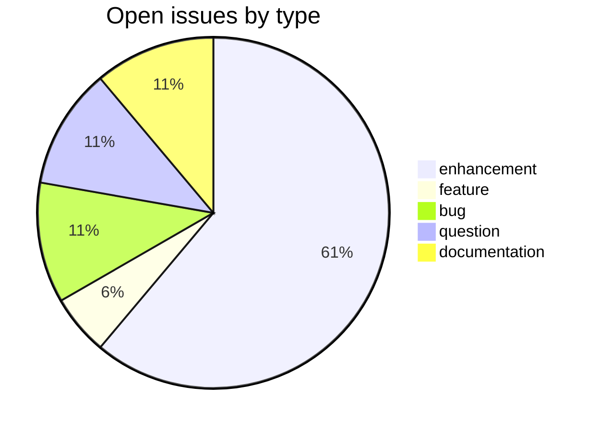
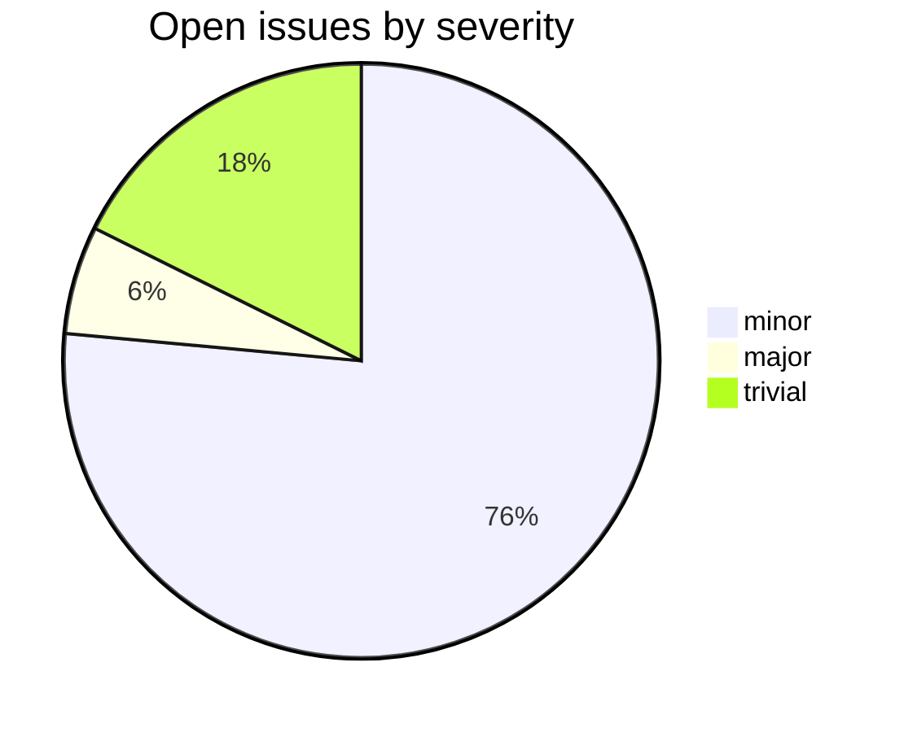

# hwnorm1

CDSL **processing-tool** repository in the Sanskrit Lexicon project.
Headword normalization across Cologne dictionaries.

## Tech Stack

- **Runtime**: Python 3 + static HTML preview
- **Build**: plain `python` scripts
- **Input**: source dictionary headwords from `csl-orig`
- **Output**: per-dictionary normalized headword tables

## Issues Overview

**Total**: 20 | **Open**: 17 | **Closed**: 3

### By Milestone

| Milestone | Open | Closed | Total |
|---|---:|---:|---:|
| API Stability | 0 | 0 | 0 |
| User Experience | 12 | 0 | 12 |
| Data Quality | 1 | 0 | 1 |
| Developer Experience | 2 | 0 | 2 |
| Community | 2 | 0 | 2 |

### By Type

### By Severity

## GitHub Issue Conventions

Follows the [Cologne tooling-repo taxonomy](https://github.com/sanskrit-lexicon/csl-observatory/blob/main/runbook/cologne-tooling-runbook.md):

- **17 type labels** across 5 categories (code quality, features, docs, infra, research)
- **4 severity levels**: trivial, minor, major, critical
- **5 milestones**: API Stability, User Experience, Data Quality, Developer Experience, Community
- **Domain labels** scoped to processing-tool: `domain:morphology`, `domain:normalization`, `domain:lookup`
- **Org Project**: [Tooling Roadmap](https://github.com/orgs/sanskrit-lexicon/projects/9)

See [CLAUDE.md](CLAUDE.md) for full definitions.

---
*Generated by Cologne Tooling Runbook on 2026-05-29*
